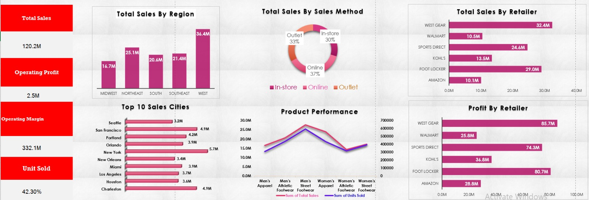

# Adidas-Sales-Analysis
Sales data analysis and Excel dashboard for Adidas products
# Adidas Sales Analysis – Excel Project

## 1. Project Objective
This project analyzes Adidas sales data to evaluate overall business performance.
The main objective is to understand sales distribution, profitability drivers, and performance differences across regions, retailers, products, and sales methods using Excel-based analysis.

The project is structured as a team-style analytical report, not just a dashboard showcase.

---

## 2. Dataset Description
The dataset represents structured Adidas sales transactions.
Each row corresponds to a sales record containing commercial, geographic, and financial attributes.

### Key Data Fields
- Retailer
- Region and city
- Sales method (In-store, Online, Outlet)
- Product category
- Units sold
- Total sales value
- Operating profit
- Operating margin

---

## 3. Data Characteristics
- Data type: Structured tabular sales data
- Granularity: Transaction-level
- Time relevance: Aggregated for performance analysis
- Suitable for KPI calculation, comparisons, and trend analysis

The dataset is appropriate for Excel pivot tables, charts, and KPI-driven dashboards.

---

## 4. Analysis Scope
The analysis focuses on answering the following business questions:
- How are total sales distributed across regions?
- Which retailers drive the highest sales and profit?
- How do different sales methods contribute to revenue?
- Which cities and product categories show stronger performance?

---

## 5. Key KPIs Summary
- Total Sales: 120.2M
- Operating Profit: 2.5M
- Units Sold: 332.1K
- Operating Margin: 42.3%

These KPIs provide a high-level view of Adidas overall sales performance.

---

## 6. Key Insights

### Regional Performance
- The West region generates the highest sales (36.4M), indicating strong market demand.
- The Midwest shows the lowest performance (16.7M), suggesting potential growth opportunities or weaker market penetration.

### Sales Method Analysis
- Online sales contribute the largest share (37%), followed by Outlet (33%) and In-store (30%).
- This highlights the growing importance of digital sales channels.

### Retailer Performance
- West Gear is the top retailer by sales (32.4M) and profit (85.7M), making it a critical business partner.
- Foot Locker and Sports Direct also show strong performance, while Amazon records lower sales contribution compared to others.

### City-Level Insights
- New York is the top-performing city (5.7M), followed by San Francisco and Charleston.
- Sales concentration in major cities suggests urban markets drive significant revenue.

### Product Performance
- Men’s Street Footwear is the highest-performing product category.
- Women’s product categories show lower sales volumes, indicating potential areas for market expansion.

---

## 7. Tools Used
- Microsoft Excel
- Pivot Tables
- Pivot Charts
- KPI Metrics
- Dashboard Design

---

## 8. Project Files
- Excel dashboard file containing full interactive analysis
---

## 9. Dashboard Preview

